# Supply Chain Data Notebooks

Repositorio de notebooks ejecutables para analítica de cadena de suministro y operaciones. Contiene datos sintéticos, cuadernos por especialidad y utilidades mínimas.

## Propósito

Esta es una **plataforma educativa ejecutable** para **líderes de supply chain** en todas sus especialidades. 
Aprende de forma práctica cómo se aplican:

- **Ingeniería de Datos**: Pipelines ETL, modelado dimensional, calidad de datos
- **Analítica Avanzada**: EDA, forecasting, análisis de riesgos, simulación
- **Inteligencia de Negocios**: KPIs, dashboards, análisis de desempeño
- **Arquitectura de Datos**: Modelado dimensional, data governance, integraciones
- **Inteligencia Artificial**: RAG, modelos predictivos, agentes generativos

Cada notebook es **100% ejecutable** con datos sintéticos reales del sector.

## Arquitectura de la Plataforma

### Flujo de datos y procesamiento


### Organización de notebooks por especialidad

```mermaid
graph TD
    Root["Supply Chain Notebooks"]

    Root --> DE["10: Data Engineering<br/>DE-01 a DE-04"]
    Root --> DA["20: Data Architecture<br/>DA-01 a DA-02"]
    Root --> DS["30: Data Science/ML<br/>DS-01 a DS-07"]
    Root --> BA["40: Business Analytics<br/>BA-01 a BA-05"]
    Root --> OR["50: Optimization/OR<br/>OR-01 a OR-09"]
    Root --> RT["60: Realtime/IoT<br/>RT-01 a RT-04, TR-01"]
    Root --> GEN["70: AI Generativa<br/>GEN-01 a GEN-02"]
    Root --> DG["80: Governance<br/>DG-01"]
    Root --> CAP["90: Capstone<br/>CAP-01"]
    Root --> UTL["99: Utilidades<br/>AP-01, SI-09"]

    %% Estilos globales (coherencia + legibilidad)
    linkStyle default stroke:#475569,stroke-width:2px,color:#334155
    classDef hub  fill:#0F172A,stroke:#0F172A,stroke-width:2px,color:#FFFFFF,rx:12,ry:12,font-weight:800
    classDef cat  fill:#F8FAFC,stroke:#334155,stroke-width:2px,color:#0F172A,rx:12,ry:12,font-weight:700

    %% Paleta por categoría (alto contraste, tonos suaves)
    classDef de   fill:#DBEAFE,stroke:#1E40AF,stroke-width:2px,color:#0F172A,rx:12,ry:12,font-weight:700
    classDef da   fill:#CCFBF1,stroke:#0F766E,stroke-width:2px,color:#0F172A,rx:12,ry:12,font-weight:700
    classDef ds   fill:#EDE9FE,stroke:#5B21B6,stroke-width:2px,color:#0F172A,rx:12,ry:12,font-weight:700
    classDef ba   fill:#FFE4E6,stroke:#9F1239,stroke-width:2px,color:#0F172A,rx:12,ry:12,font-weight:700
    classDef orc  fill:#FFEDD5,stroke:#9A3412,stroke-width:2px,color:#0F172A,rx:12,ry:12,font-weight:700
    classDef rt   fill:#DCFCE7,stroke:#166534,stroke-width:2px,color:#0F172A,rx:12,ry:12,font-weight:700
    classDef gen  fill:#E0E7FF,stroke:#3730A3,stroke-width:2px,color:#0F172A,rx:12,ry:12,font-weight:700
    classDef dg   fill:#E2E8F0,stroke:#334155,stroke-width:2px,color:#0F172A,rx:12,ry:12,font-weight:700
    classDef cap  fill:#FCE7F3,stroke:#9D174D,stroke-width:2px,color:#0F172A,rx:12,ry:12,font-weight:700
    classDef utl  fill:#F1F5F9,stroke:#475569,stroke-width:2px,color:#0F172A,rx:12,ry:12,font-weight:700

    class Root hub
    class DE de
    class DA da
    class DS ds
    class BA ba
    class OR orc
    class RT rt
    class GEN gen
    class DG dg
    class CAP cap
    class UTL utl
```



## Estado actual
- Notebooks organizados en subcarpetas por temática (Engineering, Architecture, Data Science, BI, OR, IoT, GenAI, Governance, Capstone, Utilidades).
- Datos sintéticos disponibles en `data/raw/` y salidas en `data/processed/`.
- Ejecución de notebooks verificada con `papermill` en entorno virtual.
- **40 notebooks** implementados + 2 templates, 100% ejecutables, cubriendo 10 especialidades.
- Sistema de navegación integrado entre notebooks.
- CLI unificado para gestión y validación (`python -m scripts`).

## Datos Sintéticos

Los datos se generan automáticamente con distribuciones realistas del sector logístico:

| Archivo | Registros | Descripción |
|---------|-----------|-------------|
| `products.csv` | ~200 SKUs | Catálogo de productos (Beverages, Snacks, etc.) |
| `locations.csv` | ~10-15 | Almacenes, centros de distribución, plantas |
| `orders.csv` | ~10k-50k | Órdenes de clientes con canales (Retail, E-com, B2B) |
| `inventory.csv` | ~2000-3000 | Niveles de inventario por ubicación y SKU |
| `transport_events.csv` | ~50k+ | Eventos de tracking GPS, entregas, estados |
| `calendar.csv` | 90-365 días | Calendario con festivos y promociones |

**Generar datos**: `python data/synthetic_generators/generate_cli.py`

## Requisitos
- **Python 3.10+** (tested on 3.10, 3.11)
- **PowerShell 7.0+** (Windows) o bash (Linux/Mac)
- **Disk**: ~500 MB (base) + ~1 GB (datos generados + outputs)

## Setup rápido (1-2 min)

```powershell
# 1. Clonar el repositorio
git clone https://github.com/lraigosov/supply-chain-data-notebooks.git
cd supply-chain-data-notebooks

# 2. Crear entorno virtual
python -m venv .venv
.\.venv\Scripts\Activate.ps1

# 3. Instalar dependencias
pip install -U pip
pip install -e .[core,notebooks,or,iot,web,flow]

# 4. Generar datos sintéticos (opcional, notebooks pueden generarlos)
python data/synthetic_generators/generate_cli.py --fast
```

**Verificar instalación:**
```powershell
# Ejecutar un test rápido
python -m scripts.catalog list | Select-Object -First 5
```

## Uso rápido: CLI Unificado

Navega, valida y ejecuta notebooks desde un CLI centralizado:

```powershell
# Ver comandos disponibles
python -m scripts --help

# Listar todos los notebooks
python -m scripts catalog list

# Filtrar por especialidad y nivel
python -m scripts catalog list --specialty "Data Science" --level Intro

# Buscar por palabra clave
python -m scripts catalog search "inventory"

# Ver detalles de un notebook
python -m scripts catalog show DS-01

# Ejecutar notebook(s)
python -m scripts catalog run DS-01
python -m scripts catalog run DS-01,DS-02,BA-01 --timeout 600

# Validar notebooks
python -m scripts validate

# Exportar catálogo HTML
python -m scripts export-html

# Tests rápidos
python -m scripts smoke-test --ids DS-01,BA-01
```

**Más información**: Ver [scripts/README.md](scripts/README.md) para documentación completa del CLI.

## Rutas de Aprendizaje (Learning Paths)

### 1. Para Líderes de Operaciones (Inicio rápido)
- **DS-01** (15 min): Entendimiento de datos de órdenes e inventarios
- **BA-01** (50 min): Cálculo de OTIF (métrica crítica de servicio)
- **OR-01** (55 min): Optimización de stock de seguridad

### 2. Para Analistas de Supply Chain (Intermedio)
- **DE-01** (30 min): Pipeline ETL desde sistemas transaccionales
- **DA-01** (60 min): Modelado dimensional de datos de cadena
- **DS-02** (40 min): Forecasting con detección de estacionalidad
- **BA-02-CTS** (45 min): Análisis de costos por ruta y cliente

### 3. Para Data Engineers / Architects (Avanzado)
- **DE-02** (45 min): Pipelines incrementales en tiempo real
- **OR-03** (60 min): Programación lineal para capacidad de centros
- **OR-04** (55 min): Inventario multi-echelon
- **RT-02** (50 min): Modelos predictivos de mantenimiento

### 4. Para líderes transformacionales (Full Journey)
- Seguir el orden de **Principiante → Intermedio → Avanzado** en cualquier especialidad
- Ver **Capstone** (CAP-01) como integración de todas las disciplinas

## Generar datos sintéticos

Los notebooks pueden generar datos automáticamente, pero aquí se muestran opciones manuales:

**Opción 1: Python (recomendado, multi-plataforma)**
```bash
# Generar 90 días de datos (200 SKUs, todos los archivos CSV)
python data/synthetic_generators/generate_cli.py

# Generar 7 días para testing rápido (20 SKUs)
python data/synthetic_generators/generate_cli.py --fast

# Generar con semilla reproducible (mismo dataset siempre)
python data/synthetic_generators/generate_cli.py --seed 42
```

**Opción 2: PowerShell (Windows)**
```powershell
pwsh data/synthetic_generators/generate_all.ps1
```

Los datos se generan en `data/raw/` y se cargan automáticamente en los notebooks.

## Ejecutar notebooks (papermill directo)
```bash
papermill notebooks/30_data_science_ml/DS-01-eda.ipynb notebooks/30_data_science_ml/DS-01-eda.out.ipynb
```

## Smoke tests (validar que todo funciona)
```bash
python scripts/smoke_test_notebooks.py
```

## Estructura del proyecto

```
supply-chain-data-notebooks/
├── config/                          # Configuración y índices
│   └── notebooks_index.yml          # Metadatos de todos los notebooks
├── data/
│   ├── raw/                         # CSV sintéticos generados (no incluido en git)
│   ├── processed/                   # Salidas de notebooks (no incluido en git)
│   ├── lake/                        # Data lake simulado
│   └── synthetic_generators/        # Scripts de generación de datos
├── docs/                            # Documentación
│   ├── data_dictionary.md           # Esquema de datos sintéticos
│   ├── use_case_catalog.md          # Descripción detallada de cada notebook
│   └── catalog.html                 # Catálogo interactivo (generado)
├── notebooks/                       # 42 archivos .ipynb (40 ejecutables + 2 templates)
│   ├── 00_common/                   # TEMPLATE.ipynb, PLANTILLA.ipynb
│   ├── 10_data_engineering/         # 4 notebooks (DE-01 a DE-04)
│   ├── 20_data_architecture/        # 2 notebooks (DA-01, DA-02)
│   ├── 30_data_science_ml/          # 7 notebooks (DS-01 a DS-07)
│   ├── 40_business_analytics_bi/    # 6 notebooks (BA-01, BA-02-CTS, BA-02, BA-03, BA-04, BA-05)
│   ├── 50_optimization_or/          # 10 notebooks (OR-01, OR-02-EOQ, OR-02-VRP, OR-03 a OR-09)
│   ├── 60_realtime_iot/             # 5 notebooks (RT-01 a RT-04, TR-01)
│   ├── 70_ai_gen_agents/            # 2 notebooks (GEN-01, GEN-02)
│   ├── 80_governance_quality/       # 1 notebook (DG-01)
│   ├── 90_capstone_end2end/         # 1 notebook (CAP-01)
│   └── 99_utilidades/               # 2 notebooks (AP-01, SI-09)
├── scripts/                         # Herramientas CLI y validación (12 archivos)
│   ├── cli.py                       # CLI unificado principal (python -m scripts)
│   ├── catalog.py                   # Listar, ejecutar, filtrar notebooks
│   ├── add_navigation.py            # Añadir navegación entre notebooks
│   ├── validate_notebook_*.py       # Validación de metadatos y estructura
│   ├── export_catalog_html.py       # Generar catálogo HTML interactivo
│   ├── smoke_test_notebooks.py      # Tests rápidos de ejecución
│   └── README.md                    # Documentación completa de scripts
├── src/                             # Código reutilizable
│   └── utils/                       # Configuración, I/O, logging, paths
├── tests/                           # Suite de tests
│   ├── data_tests/                  # Validaciones de datos
│   └── unit_tests/                  # Tests unitarios
├── .gitignore                       # Excluye: .venv, data/raw, data/processed, *.csv
├── CONTRIBUTING.md                  # Guía para crear nuevos notebooks
├── LICENSE                          # MIT License
├── pyproject.toml                   # Configuración de proyecto (Python 3.10+)
├── README.md                        # Este archivo
└── requirements.txt                 # Dependencias pinned (backup)
```

**Notas sobre .gitignore:**
- ✅ `data/raw/`, `data/processed/`: No incluidos (generados localmente)
- ✅ `.venv/`: Entorno virtual (generado localmente)
- ✅ `*.csv`: Datos procesados (generados localmente)
- ⚠️ **Secretos**: Solo `.env` está ignorado por git. GEN-02 solicita API key interactivamente (opcional, tiene modo demo sin API).

## Índice de Notebooks (40 implementados)

Tabla completa generada desde `config/notebooks_index.yml`. 

**Leyenda de niveles:**
- 🟢 **Intro**: 15-30 min, conceptos fundamentales
- 🟡 **Intermediate**: 30-60 min, aplicaciones avanzadas
- 🔴 **Advanced**: 60+ min, casos complejos de producción

<!-- NOTEBOOKS-TABLE:START -->
| ID | Título | Especialidad | Nivel | Notebook |
| --- | --- | --- | --- | --- |
| DE-01 | Ingesta batch desde WMS a DWH | Data Engineering | Intermediate | [DE-01-ingesta.ipynb](notebooks/10_data_engineering/DE-01-ingesta.ipynb) |
| DE-02 | Pipeline incremental de órdenes | Data Engineering | Intermediate | [DE-02-pipeline_incremental.ipynb](notebooks/10_data_engineering/DE-02-pipeline_incremental.ipynb) |
| DE-03 | ETL Básico con Pandas | Data Engineering | Intro | [DE-03-etl_basico.ipynb](notebooks/10_data_engineering/DE-03-etl_basico.ipynb) |
| DE-04 | Pipeline Streaming con Kafka | Data Engineering | Advanced | [DE-04-kafka_streaming.ipynb](notebooks/10_data_engineering/DE-04-kafka_streaming.ipynb) |
| DA-01 | Modelo dimensional para inventarios | Data Architecture | Intermediate | [DA-01-modelo_dimensional.ipynb](notebooks/20_data_architecture/DA-01-modelo_dimensional.ipynb) |
| DA-02 | Data Lake con Particiones | Data Architecture | Intermediate | [DA-02-data_lake_partitions.ipynb](notebooks/20_data_architecture/DA-02-data_lake_partitions.ipynb) |
| DS-01 | EDA de órdenes e inventarios | Data Science | Intro | [DS-01-eda.ipynb](notebooks/30_data_science_ml/DS-01-eda.ipynb) |
| DS-02 | Detección de estacionalidad en demanda | Data Science | Intermediate | [DS-02-estacionalidad.ipynb](notebooks/30_data_science_ml/DS-02-estacionalidad.ipynb) |
| DS-03 | Service level vs cost trade-off | Data Science | Intermediate | [DS-03-service_level_cost_tradeoff.ipynb](notebooks/30_data_science_ml/DS-03-service_level_cost_tradeoff.ipynb) |
| DS-04 | Last mile analytics | Data Science | Intermediate | [DS-04-last_mile_analytics.ipynb](notebooks/30_data_science_ml/DS-04-last_mile_analytics.ipynb) |
| DS-05 | Supply risk scenarios | Data Science | Intermediate | [DS-05-supply_risk_scenarios.ipynb](notebooks/30_data_science_ml/DS-05-supply_risk_scenarios.ipynb) |
| DS-06 | Forecast de Demanda con ARIMA | Data Science | Intermediate | [DS-06-forecast_arima.ipynb](notebooks/30_data_science_ml/DS-06-forecast_arima.ipynb) |
| DS-07 | ML Clasificación de Riesgo de Proveedores | Data Science | Advanced | [DS-07-supplier_risk_ml.ipynb](notebooks/30_data_science_ml/DS-07-supplier_risk_ml.ipynb) |
| BA-01 | Dashboard OTIF (On-Time In-Full) | Business Analytics | Intermediate | [BA-01-dashboard_otif.ipynb](notebooks/40_business_analytics_bi/BA-01-dashboard_otif.ipynb) |
| BA-02-CTS | Cost-to-Serve | Business Analytics | Intermediate | [BA-02-cost_to_serve.ipynb](notebooks/40_business_analytics_bi/BA-02-cost_to_serve.ipynb) |
| BA-02 | Planeación S&OP con escenarios de demanda | Business Analytics | Intermediate | [BA-02-sop_scenarios.ipynb](notebooks/40_business_analytics_bi/BA-02-sop_scenarios.ipynb) |
| BA-03 | Productividad de almacén | Business Analytics | Intermediate | [BA-03-warehouse_productivity.ipynb](notebooks/40_business_analytics_bi/BA-03-warehouse_productivity.ipynb) |
| BA-04 | Desempeño de proveedores | Business Analytics | Intermediate | [BA-04-supplier_performance.ipynb](notebooks/40_business_analytics_bi/BA-04-supplier_performance.ipynb) |
| BA-05 | Dashboard Ejecutivo de Supply Chain | Business Analytics | Intro | [BA-05-dashboard_ejecutivo.ipynb](notebooks/40_business_analytics_bi/BA-05-dashboard_ejecutivo.ipynb) |
| OR-01 | Cálculo de stock de seguridad | Optimization & OR | Intermediate | [OR-01-stock_seguridad.ipynb](notebooks/50_optimization_or/OR-01-stock_seguridad.ipynb) |
| OR-02-EOQ | Políticas de inventario (EOQ) | Optimization & OR | Intermediate | [OR-02-politicas_inventario.ipynb](notebooks/50_optimization_or/OR-02-politicas_inventario.ipynb) |
| OR-02-VRP | VRP con restricción de capacidad | Optimization & OR | Advanced | [OR-02-vrp_capacidad.ipynb](notebooks/50_optimization_or/OR-02-vrp_capacidad.ipynb) |
| OR-03 | Planeación de capacidad en CD y flota | Optimization & OR | Advanced | [OR-03-capacity_planning_dc_fleet.ipynb](notebooks/50_optimization_or/OR-03-capacity_planning_dc_fleet.ipynb) |
| OR-04 | Inventario multi‑echelon | Optimization & OR | Advanced | [OR-04-multi_echelon_inventory.ipynb](notebooks/50_optimization_or/OR-04-multi_echelon_inventory.ipynb) |
| OR-05 | Warehouse slotting | Optimization & OR | Intermediate | [OR-05-warehouse_slotting.ipynb](notebooks/50_optimization_or/OR-05-warehouse_slotting.ipynb) |
| OR-06 | Simulación de colas en andenes | Optimization & OR | Intermediate | [OR-06-dock_queue_simulation.ipynb](notebooks/50_optimization_or/OR-06-dock_queue_simulation.ipynb) |
| OR-07 | Cálculo de Stock de Seguridad | Optimization & OR | Intro | [OR-07-safety_stock_intro.ipynb](notebooks/50_optimization_or/OR-07-safety_stock_intro.ipynb) |
| OR-08 | Programación de Producción con PuLP | Optimization & OR | Intermediate | [OR-08-production_scheduling.ipynb](notebooks/50_optimization_or/OR-08-production_scheduling.ipynb) |
| OR-09 | Optimización de Red Logística Multiobjetivo | Optimization & OR | Advanced | [OR-09-network_optimization.ipynb](notebooks/50_optimization_or/OR-09-network_optimization.ipynb) |
| RT-01 | Simulación de stream de tracking | Realtime & IoT | Intro | [RT-01-stream_tracking.ipynb](notebooks/60_realtime_iot/RT-01-stream_tracking.ipynb) |
| RT-02 | Mantenimiento predictivo de flota | Realtime & IoT | Intermediate | [RT-02-fleet_predictive_maintenance.ipynb](notebooks/60_realtime_iot/RT-02-fleet_predictive_maintenance.ipynb) |
| RT-03 | Monitoreo de cadena de frío | Realtime & IoT | Intermediate | [RT-03-cold_chain_monitoring.ipynb](notebooks/60_realtime_iot/RT-03-cold_chain_monitoring.ipynb) |
| RT-04 | Visualización Básica de Sensores IoT | Realtime & IoT | Intro | [RT-04-iot_sensors_intro.ipynb](notebooks/60_realtime_iot/RT-04-iot_sensors_intro.ipynb) |
| TR-01 | Análisis de transporte masivo con GTFS | Realtime & IoT | Intermediate | [TR-01-transporte_masivo.ipynb](notebooks/60_realtime_iot/TR-01-transporte_masivo.ipynb) |
| GEN-01 | RAG para consultas de KPIs | AI Generativa | Intro | [GEN-01-rag_kpi.ipynb](notebooks/70_ai_gen_agents/GEN-01-rag_kpi.ipynb) |
| GEN-02 | LLM para Análisis de Texto en Supply Chain | AI Generativa | Intermediate | [GEN-02-llm_text_analysis.ipynb](notebooks/70_ai_gen_agents/GEN-02-llm_text_analysis.ipynb) |
| DG-01 | Perfilado de calidad de datos maestro | Data Governance | Intro | [DG-01-perfilado_calidad.ipynb](notebooks/80_governance_quality/DG-01-perfilado_calidad.ipynb) |
| CAP-01 | Torre de control | Capstone | Intro | [CAP-01-torre_control.ipynb](notebooks/90_capstone_end2end/CAP-01-torre_control.ipynb) |
| AP-01 | Apply en DataFrames - Tutorial de pandas | Utilidades | Intro | [AP-01-aplicar_todo_dataframe.ipynb](notebooks/99_utilidades/AP-01-aplicar_todo_dataframe.ipynb) |
| SI-09 | Flujo ML end-to-end con scikit-learn | Utilidades | Intermediate | [SI-09-flujo_si9.ipynb](notebooks/99_utilidades/SI-09-flujo_si9.ipynb) |
<!-- NOTEBOOKS-TABLE:END -->

## Recursos y Documentación

| Recurso | Descripción | Quién lo usa |
|---------|-------------|-------------|
| [Catálogo Interactivo](docs/catalog.html) | Browser para filtrar/buscar notebooks | Ejecutivos, managers |
| [Diccionario de Datos](docs/data_dictionary.md) | Esquema de todos los CSV sintéticos | Data engineers, analistas |
| [Catálogo de Casos](docs/use_case_catalog.md) | Descripción detallada de cada notebook | Líderes de proyecto, instructores |
| [Guía de Contribución](CONTRIBUTING.md) | Cómo crear nuevos notebooks | Data scientists, desarrolladores |
| [Catálogo YAML](config/notebooks_index.yml) | Metadatos máquina-legible | Scripts, automatización |

## FAQ

**¿Necesito instalar dependencias especiales?**
No, `pip install -e .[core,notebooks,or,iot,web,flow]` instala todo. Alternativamente: `pip install -r requirements.txt`.

**¿Puedo ejecutar los notebooks sin generar datos?**
Sí, la mayoría pueden generarlos automáticamente con `generate_cli.py` o crear datasets sintéticos internos.

**¿Cuánto espacio necesito?**
~1.5 GB total (base 500 MB + datos 500 MB + outputs 500 MB).

**¿Dónde envío sugerencias o reporto errores?**
Abre un issue en [GitHub Issues](https://github.com/lraigosov/supply-chain-data-notebooks/issues).

## Notas
- No se incluyen ni documentan contenidos fuera del árbol del repositorio.
- Datos sintéticos: reproducibles con `--seed` para casos de auditoría.
- Todos los notebooks son 100% ejecutables en Python 3.10+ con papermill.
- Datos reales no se incluyen; todos los CSV son sintéticos pero realistas.

## Créditos y Licencia
- **Autor y mantenimiento**: lraigosov  
- **Licencia**: MIT (Ver archivo `LICENSE` del repositorio)  
- **Versión**: 0.1.0  
- **Estado**: Plataforma educativa activa
